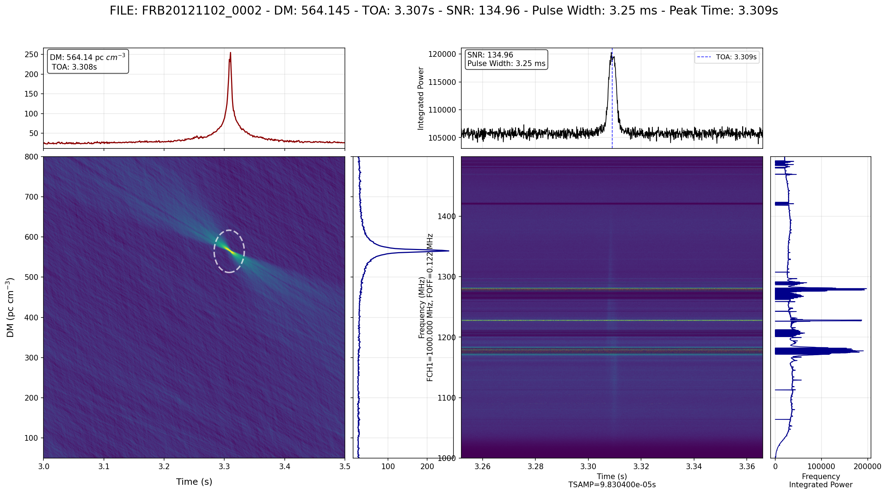

# /home/lingh/work/astroflow/README.md
# Astroflow

A modern Python framework for pulsar and fast radio burst (FRB) data analysis, featuring advanced single pulse search capabilities and real-time processing pipelines.

## Features

- **Single Pulse Search**: Advanced algorithms for detecting transient radio signals
- **Real-time Processing**: Efficient data pipelines for live observations
- **Candidate Analysis**: Comprehensive tools for signal classification and validation
- **Visualization**: Interactive plotting and candidate inspection tools
- **Flexible Architecture**: Modular design supporting various backends and data formats

## Installation

### Method 1: Install from PyPI (Recommended)
```bash
# for ubuntu18+ python>=3.10
pip install pulseflow
```

### Method 2: Development Installation
```bash
git clone https://github.com/lintian233/astroflow.git
cd astroflow
source configure.sh
pip install -e .
```

### Method 3: Source Configuration
```bash
git clone https://github.com/lintian233/astroflow.git
cd astroflow
source configure.sh
```

## Quick Start

### Single Pulse Search Example

```bash
pulseflow fast.yaml
```

### Example Output



*Example of a detected single pulse candidate showing dedispersed time series and diagnostic plots.*

## Core Components

- **Data I/O**: Support for SIGPROC filterbank, PSRFITS, and custom formats
- **Signal Processing**: Dedispersion, RFI mitigation, and matched filtering
- **Machine Learning**: AI-powered candidate classification
- **Visualization**: Interactive dashboards and publication-ready plots

## Documentation

- **API Reference**: [https://pulseflow.readthedocs.io/](https://pulseflow.readthedocs.io/)
- **User Guide**: [https://pulseflow.readthedocs.io/en/latest/userguide/](https://pulseflow.readthedocs.io/en/latest/userguide/)
- **Tutorials**: [https://pulseflow.readthedocs.io/en/latest/tutorials/](https://pulseflow.readthedocs.io/en/latest/tutorials/)
- **Examples**: [https://github.com/lintian233/astroflow/tree/main/examples](https://github.com/lintian233/astroflow/tree/main/examples)

## Contributing

We welcome contributions! Please see our [Contributing Guide](CONTRIBUTING.md) for details.

## License

This project is licensed under the MIT License - see the [LICENSE](LICENSE) file for details.

## Citation

If you use PulseFlow in your research, please cite:

```bibtex
@software{pulseflow,
  title={PulseFlow: High-performance radio astronomy single pulse search pipline},
  author={lintian233},
  year={2024},
  url={https://github.com/lintian233/astroflow}
}
```

## Support

- **Issues**: [GitHub Issues](https://github.com/lintian233/astroflow/issues)
- **Discussions**: [GitHub Discussions](https://github.com/lintian233/astroflow/discussions)