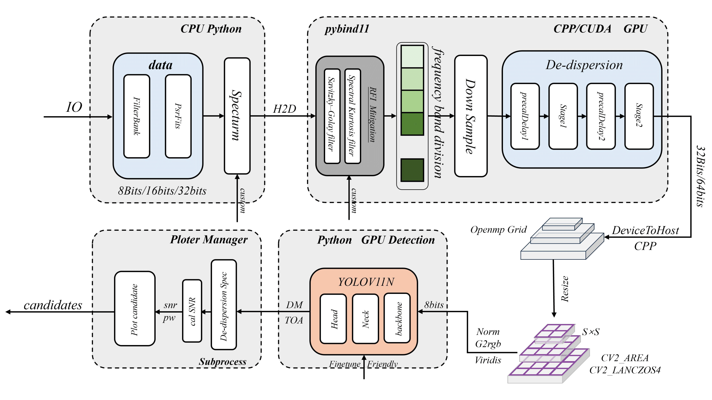
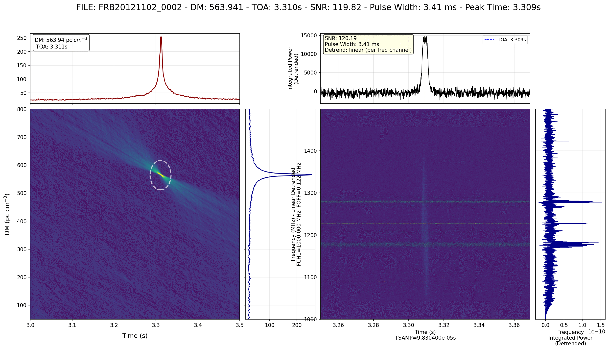

<div align="center">

# AstroFlow

**A GPU-accelerated pipeline for radio single-pulse and fast radio burst searches**

<p>
  <a href="https://pypi.org/project/pulseflow/">
    </a>
  <a href="https://pepy.tech/project/pulseflow">
    </a>
  <a href="https://hub.docker.com/r/lintian233/astroflow-build">
    </a>
  <a href="https://lintian233.github.io/astroflow/">
    </a>
  <a href="https://github.com/lintian233/astroflow/issues">
    </a>
  <a href="LICENSE">
    </a>
</p>

</div>

AstroFlow is an end-to-end search pipeline for radio single pulses and fast radio bursts (FRBs). It combines CUDA-accelerated dedispersion, RFI mitigation, AI-assisted candidate detection, and publication-ready candidate visualization in a YAML-configured command-line workflow. The pipeline supports FILTERBANK (`.fil`) and PSRFITS (`.fits`) observations and is designed for high-throughput offline or near-real-time searches.

<div align="center">
  <p>
    <strong>Documentation:</strong>
    <a href="https://lintian233.github.io/astroflow/">https://lintian233.github.io/astroflow/</a>
  </p>
</div>

<div align="center">
  
</div>

## Preview

<div align="center">
  
</div>

## Installation

Python 3.10 to 3.12 is recommended.

```bash
pip install pulseflow
```

<p>
  <strong>Read the full documentation:</strong>
  <a href="https://lintian233.github.io/astroflow/">https://lintian233.github.io/astroflow/</a>
</p>

<details>
  <summary>Source Build</summary>

Source builds require CUDA Toolkit 12.6 or newer, GCC/G++ 11.4 or compatible, CMake 3.22 or newer, Conan 2.x, Ninja, and Python 3.10 to 3.12.

```bash
git clone https://github.com/lintian233/astroflow
cd astroflow
bash configure.sh
conda activate dev-astroflow-ml
bash build.sh
pip install -e .
```

Development builds are also published to TestPyPI:

```bash
pip install --pre -i https://test.pypi.org/simple/ pulseflow --extra-index-url https://pypi.org/simple
```

</details>

## Dataset and Model

See the **[Dataset and Model page](https://lintian233.github.io/astroflow/dataset_model_release.html)** for the **public training dataset** and **released model weights**.

## Citation

If AstroFlow is useful in your research, please cite:

> **ASTROFLOW: A Real-Time End-to-End Pipeline for Radio Single-Pulse Searches**  
> [https://doi.org/10.3847/1538-4365/ae4a26](https://doi.org/10.3847/1538-4365/ae4a26)

## Community
<a href="https://github.com/lintian233/astroflow/graphs/contributors">
  
</a>


## Star History

<a href="https://www.star-history.com/#lintian233/astroflow&Date">
 <picture>
   <source media="(prefers-color-scheme: dark)" srcset="https://api.star-history.com/svg?repos=lintian233/astroflow&type=Date&theme=dark" />
   <source media="(prefers-color-scheme: light)" srcset="https://api.star-history.com/svg?repos=lintian233/astroflow&type=Date" />
   
 </picture>
</a>
