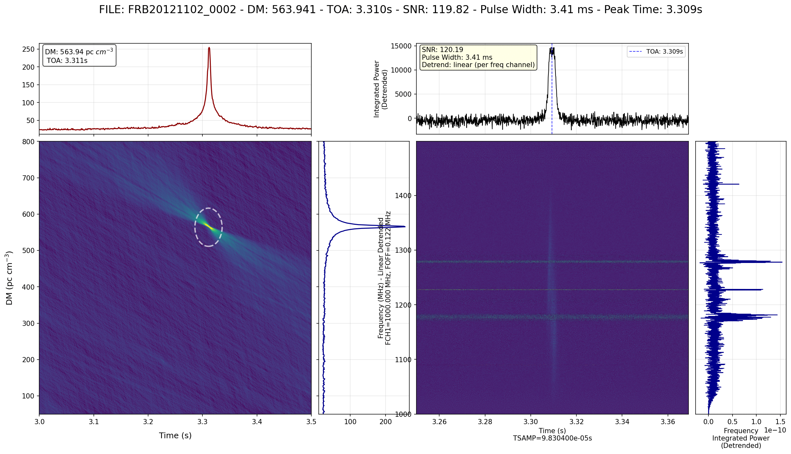

<div align="center">

[English](../README.md) | 简体中文

<!--  -->

<h2 id="title">AstroFlow 🌌</h2>

<p>
  <!-- Package & registry badges -->
  <a href="https://pypi.org/project/pulseflow/">
    </a>
  <a href="https://pepy.tech/project/pulseflow">
    </a>
  <a href="https://hub.docker.com/r/lintian233/astroflow-build">
    </a>
  <a href="https://github.com/lintian233/astroflow/issues">
    </a>
  <a href="LICENSE">
    </a>
</p>

<!-- <a href="https://trendshift.io/repositories/astroflow" target="_blank">
  
</a> -->

</div>

一站式实时GPU加速单脉冲/快速射电暴搜索流水线

- ⚡ **GPU加速处理** - CUDA消色散与高级优化（FMA、共享内存、循环展开）
- 🤖 **AI驱动检测** - YOLOv11n在10万+快速射电暴数据集上训练，高精度检测
- 🧹 **完整RFI抑制** - RFI去除，支持PSRFITS和FILTERBANK格式
- ⚙️ **用户友好流水线** - 简单的YAML配置，Docker部署友好

反馈：使用 [Issues](https://github.com/lintian233/astroflow/issues) 或 [Discussions](https://github.com/lintian233/astroflow/discussions)。
<!-- 参见 [贡献指南](./CONTRIBUTING.md) 了解如何参与。 -->

<h2 id="updates">更新</h2>

- **2025年8月21日** — `astroflow` CLI公开预览；集成CUDA消色散和基于YOLO的检测器
- **2025年8月20日** — Docker镜像（CUDA 12.x，PyTorch）和端到端基准测试脚本

<!-- > [!NOTE]
> 路线图和里程碑在 [Projects](https://github.com/lintian233/astroflow/projects) 中跟踪。 -->

<h2 id="preview">预览</h2>

<div align="center">
  
</div>

### 安装方法

<details open>
  <summary>pip安装</summary>

1. 推荐Python 3.10–3.12。

2. 安装：
   ```bash   
   pip install pulseflow
   ```

3. 快速开始：
   请查看[快速开始](./quick_start_zh-CN.md)

</details>

<details>
  <summary>源码安装</summary>
1. 需要cudatoolkit>=12.0 glibc>=2.27 gcc/gxx>=11.0 ubuntu18.04+。

2. git clone 
    ```bash
    git clone https://github.com/lintian233/astroflow 
    cd astroflow
    ```
3. 从源码构建
   ```bash
   source configure.sh
   ```
4. pip安装
   ```bash
   pip install -e .
   ```

</details>

<h2 id="citation">引用</h2>

如果您在研究中使用了**AstroFlow**，请引用我们的工作：

> [!NOTE]
> 描述AstroFlow流水线的科学论文目前**正在准备中**。
> 我们将在手稿发表后更新此部分的正式论文引用。
> 请定期查看更新或关注此仓库的公告。
> 与此同时，请引用此仓库：
> 
```bibtex
@misc{astroflow2025,
  title={AstroFlow: GPU-accelerated single-pulse/FRB search pipeline},
  author={lintian233},
  year={2025},
  url={https://github.com/lintian233/astroflow},
  note={Software pipeline for fast radio burst detection and analysis}
}
```

<h2 id="usage">YAML配置</h2>

以下是常用的YAML配置选项：

<details open>
  <summary>基础配置</summary>

| 选项 | 描述 | 示例 | 必需 |
|------|------|------|------|
| `input` | 输入文件路径或目录 | `B0534+2200.fil/fits` | ✓ |
| `output` | 输出目录路径 | `B0534+2200_results` | ✓ |
| `mode` | 处理模式 | `single`/`multi`/`monitor`/`dataset` | ✓ |
| `candpath` | 候选文件路径（用于dataset模式） | `candidates.csv` | 仅用于dataset模式 |

</details>

<details>
  <summary>GPU和处理</summary>

| 选项 | 描述 | 示例 | 默认值 |
|------|------|------|-------|
| `dedgpu` | 消色散GPU ID | `0` | `0` |
| `detgpu` | 检测GPU ID | `1` | `0` |
| `cputhread` | CPU线程数 | `64` | `8` |
| `plotworker` | 绘图工作进程数 | `16` | `4` |

</details>

<details>
  <summary>检测参数</summary>

| 选项 | 描述 | 示例 | 默认值 |
|------|------|------|-------|
| `confidence` | 检测置信度阈值 | `0.4` | `0.372` |
| `snrhold` | 信噪比阈值 | `5` | `5` |
| `modelname` | 检测器模型类型 | 目前仅支持 `yolov11n` |
| `modelpath` | 自定义模型权重路径 | `/path/to/yolo11n_0816_v1.pt` | - |
| `timedownfactor` | 时间降采样因子 | `8` | `1` |

</details>

<details>
  <summary>时间和DM配置</summary>

| 选项 | 描述 | 示例 |
|------|------|------|
| `tsample` | 时间采样配置 | 见下方 |
| `dm_limt` | DM限制范围 | 见下方 |
| `dmrange` | DM搜索范围 | 见下方 |

```yaml
tsample:
  - name: t0
    t: 0.5  # 秒（用于单脉冲）
```

```yaml
dm_limt:
  - name: limt1
    dm_low: 50
    dm_high: 60
  - name: limt4
    dm_low: 100
    dm_high: 700
```

```yaml
dmrange:
  - name: dm1
    dm_low: 50
    dm_high: 60
    dm_step: 0.018
  - name: dm3
    dm_low: 80
    dm_high: 700
    dm_step: 1
```

</details>

<details>
  <summary>频率配置</summary>

| 选项 | 描述 | 示例 |
|------|------|------|
| `freqrange` | 处理频率范围 | 见下方 |

```yaml
freqrange:
  - name: freq1
    freq_start: 1030  # MHz
    freq_end: 1445    # MHz（全频段）
  - name: freq2
    freq_start: 1030
    freq_end: 1250    # MHz（子频段1）
  - name: freq3
    freq_start: 1250
    freq_end: 1445    # MHz（子频段2）
    # FAST数据
  - name: freq3
    freq_start: 1000
    freq_end: 1499.5  # MHz
```

</details>

<details>
  <summary>RFI抑制</summary>

| 选项 | 描述 | 示例 | 默认值 |
|------|------|------|-------|
| `rfi` | RFI配置 | 见下方 | - |
| `maskfile` | 单个RFI掩码文件 | `/path/to/file` | - |
| `maskdir` | 包含RFI掩码的目录 | `/path/to/RFI_MASK/` | - |

**RFI配置：**
```yaml
rfi:
  use_mask: 0      # 使用外部掩码文件 (0/1)
  use_iqrm: 1      # 使用IQRM算法进行RFI检测 (0/1)
  use_zero_dm: 1   # 使用零色散度进行RFI检测 (0/1)

iqrm:
  mode: 1            # 统计模式：0=均值，1=标准差
  radius_frac: 0.10  # 滞后选择的半径分数
  nsigma: 3.0        # 异常值检测的σ阈值
  geofactor: 1.5     # 滞后递进的几何因子
  win_sec: 0         # 窗口大小（秒）（0表示使用全部数据）
  hop_sec: 1.0       # 滑动窗口的跳跃大小（秒）
  include_tail: true # 是否包含末尾剩余数据

# 传统基于掩码的RFI抑制
maskfile: /path/to/maskdfile.bad_chans
# 或使用目录处理多个文件
maskdir: /path/to/maskdir
```

**RFI IQRM算法：**
AstroFlow实现了[Bhardwaj et al.(2022)](https://academic.oup.com/mnras/article/510/1/1393/6449380?login=false)论文中描述的IQRM（迭代四分位距抑制）算法，并提供完整的GPU加速。算法详细细节参见
</details>

<!-- <details>
  <summary>数据处理</summary>

| 选项 | 描述 | 示例 |
|------|------|------|
| `preprocess` | 预处理流水线 | 见下方 |

```yaml
preprocess:
  - clip: 0.01                # 裁剪阈值
  - meadianbulr: 1 3         # 中值模糊参数
  - guassion: 1 5            # 高斯滤波参数
```

</details> -->

<details>
  <summary>绘图配置</summary>

| 选项 | 描述 | 示例 |
|------|------|------|
| `dmtconfig` | DMT图配置 | 见下方 |
```yaml
dmtconfig:
  minpercentile: 0           # 缩放最小百分位数
  maxpercentile: 100         # 最大百分位数（FAST数据使用99.9）
  meadianbulr: 1 3          # DMT图中值模糊
  guassion: 1 5             # DMT图高斯滤波
```

| 选项 | 描述 | 示例 |
|------|------|------|
| `specconfig` | 频谱图配置 | 见下方 |

```yaml
specconfig:
  minpercentile: 0          # 缩放最小百分位数
  maxpercentile: 100        # 缩放最大百分位数
  tband: 20                 # 时间带宽，毫秒（FAST数据使用120）
  mode: subband             # 绘图模式：subband/standard
```

</details>

<details>
  <summary>实际示例</summary>

**单脉冲星观测（蟹状星云脉冲星）：**
```yaml
input: B0534+2200_20250413_194909_ant01p0.fil 
output: B0534+2200_20250413_194909
mode: single

timedownfactor: 1
confidence: 0.4
dedgpu: 0
detgpu: 1
cputhread: 32

snrhold: 5
modelname: yolov11n
# 使用默认模型
# modelpath: yolo11n_0816_v1.pt 

rfi:
  use_mask: 0
  use_iqrm: 1
  use_zero_dm: 0

iqrm:
  mode: 1
  radius_frac: 0.10
  nsigma: 3.0
  geofactor: 1.5
  win_sec: 0
  hop_sec: 1.0
  include_tail: true

tsample:
  - name: t0
    t: 0.05

dm_limt:
  - name: limt1
    dm_low: 50
    dm_high: 60

dmrange:
  - name: dm1
    dm_low: 50
    dm_high: 60
    dm_step: 0.018

dmtconfig:
  minpercentile: 0
  maxpercentile: 99.9
  meadianbulr: 1 3
  guassion: 1 5

specconfig:
  minpercentile: 0    
  maxpercentile: 100
  tband: 10 #ms
  mode: subband # subband/standard

```

**FAST_FREX数据集处理：**
```yaml
input: FAST_PREFIX_DATA
output: FAST_PREFIX
mode: dataset

candpath: fast_prefix_candidate.csv
timedownfactor: 8
confidence: 0.372

dedgpu: 0
detgpu: 1
cputhread: 64

modelname: yolov11n
# 使用默认模型
# modelpath: yolo11n_0816_v1.pt 
plotworker: 16

rfi:
  use_mask: 0
  use_iqrm: 1        # 同时使用IQRM进行额外的RFI检测
  use_zero_dm: 0

iqrm:
  mode: 1
  radius_frac: 0.10
  nsigma: 7.0
  geofactor: 1.5
  win_sec: 0
  hop_sec: 1.0
  include_tail: true

# 外部掩码目录
maskdir: FAST_PREFIX_RFI_MASK

tsample:
  - name: t2
    t: 0.5

dm_limt:
  - name: limt4
    dm_low: 100
    dm_high: 700

dmrange:
  - name: dm3
    dm_low: 80
    dm_high: 700
    dm_step: 1

freqrange:
  - name: freq3
    freq_start: 1000
    freq_end: 1499.5

dmtconfig:
  minpercentile: 0
  maxpercentile: 99.9
  meadianbulr: 1 3
  guassion: 1 5

specconfig:
  minpercentile: 0    
  maxpercentile: 100
  tband: 120 #ms
  mode: standard # subband/standard

```
</details>

<h2 id="contrib">贡献者</h2>

<a href="https://github.com/lintian233/astroflow/graphs/contributors">
  
</a>


<h2 id="star_hist">Star历史</h2>

<a href="https://star-history.com/#lintian233/astroflow&Date">
 <picture>
   <source media="(prefers-color-scheme: dark)" srcset="https://api.star-history.com/svg?repos=lintian233/astroflow&type=Date&theme=dark" />
   <source media="(prefers-color-scheme: light)" srcset="https://api.star-history.com/svg?repos=lintian233/astroflow&type=Date" />
   
 </picture>
</a>
