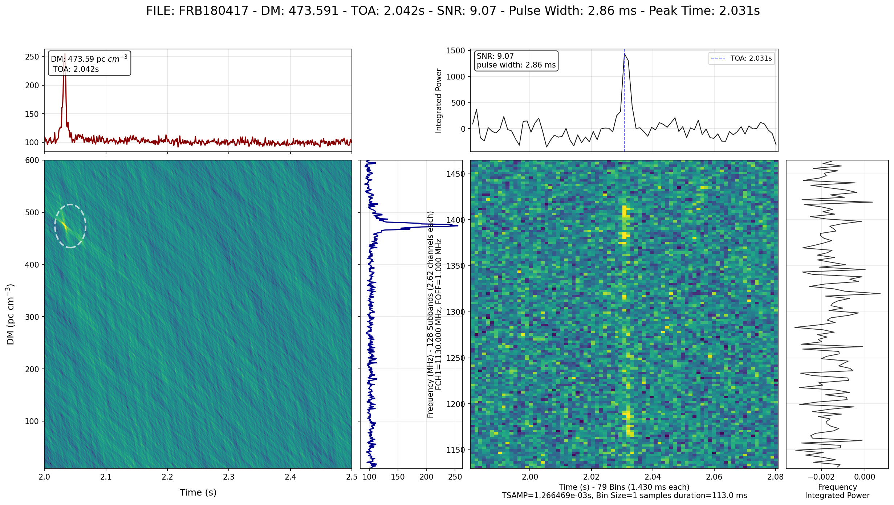

# Quick Start: Run astroflow on FRB180417

## 1) Get the test file

**Option A: Zenodo (recommended)**
```bash
wget -O FRB180417.fil "https://zenodo.org/record/3905426/files/FRB180417.fil"
```

**Option B: GitHub raw (alternate mirror)**  
```bash
curl -L -o FRB180417.fil   "https://raw.githubusercontent.com/lintian233/astroflow/main/tests/FRB180417.fil"
```

Quick check:
```bash
ls -lh FRB180417.fil
```

```bash
-rw-r--r-- 1 root root 1.7M Aug 26 20:12 FRB180417.fil
```

---

## 2) Create a run config

Save as `frb180417.yaml`:

```yaml
# frb180417.yaml

input: FRB180417.fil      # Input file path (case-sensitive)
output: frb180417         # Output directory prefix (plots & logs go here)

mode: single              # One of [single, muti, dataset, monitor]

timedownfactor: 1         # Downsample factor for time axis
confidence: 0.4           # Detector confidence threshold

dedgpu: 0                 # GPU index for dedispersion
detgpu: 0                 # GPU index for detection
cputhread: 8              # CPU workers (I/O, prep)

plotworker: 2             # Plotting workers

modelname: yolov11n       # Detection model (current: yolov11n)

# maskfile: none.txt      # RFI mask file (or  disable)

tsample:
  - name: t1
    t: 0.5                 # seconds per detection slice 
    # (pulse_width ~ 1-10 ms 0.5s is recommended )
    # (pulsewith ~ 0.1-0.5 ms 0.05s is is recommended )


# human-readable label for DM limits
dm_limt:
  - name: limt1
    dm_low: 0
    dm_high: 800

# Actual DM search grid FRB181407 DM is 474.8 
dmrange:
  - name: dm_10_600
    dm_low: 10
    dm_high: 600
    dm_step: 1  #DM trails > 500 is strong recommended

# Frequency window (MHz)
freqrange:
  - name: fullband
    freq_start: 1130
    freq_end: 1465
#   - name: lowband
#     freq_start: 1130
#     freq_end: 1250


# DMT (DM–time) plot scaling
dmtconfig:
  minpercentile: 0
  maxpercentile: 99.99

# Dynamic spectrum plot scaling
specconfig:
  minpercentile: 0.1
  maxpercentile: 99
  tband: 120                # time bands
  mode: subband             # one of [subband, standard, detrend]
```

> Notes
> - If you run on a multi-GPU box, switch `dedgpu`/`detgpu` to the indices you want (or use `CUDA_VISIBLE_DEVICES`).

---

## 3) Run

```bash
astroflow frb180417.yaml
```

You should see logs like:
```
Detected mode: single
Starting single file search for: FRB180417.fil
Using device: cuda:0 NAME: NVIDIA GeForce GTX 1660 SUPER
...
DM Range: 10-600, Freq Range: 1130-1465, TSample: 0.5
...
Typed data shape: [591, 5120]
Typed slicing preprocessing completed: 13 slices generated
Processed 12 samples in one batch.
Plotting candidate: DM=473.591, TOA=2.042, Freq=1130-1465 MHz, ...
Saving 21.85_4.44_473.591_2.042_frb180417_T_2.0s_2.5s_DM_10_600_F_1130_1465.png
```

---

## 4) View the results

Images are written under the `output` prefix, e.g.:
```bash
ls frb180417/detect/*.png 

display frb180417/detect/*.png
```

You should see png like:

<div align="center">
  
</div>

---

## 5) Troubleshooting

### Model Download Failure

`astroflow` will automatically download the required AI model on its first run. If you see an error message like the one below, it means the automatic download failed after several attempts, likely due to network issues or file corruption.

```
Warning: Model file checksum mismatch on attempt 1/3. Expected d4305e273fec6f5733f3c0a823fa5275064b015d549fda26529e0b1b8f59c124, but got xxxxxxx. The file is corrupted and will be re-downloaded.
.......
Error: Failed to download model from https://github.com/lintian233/astroflow/releases/download/v0.1.1/yolo11n_0816_v1.pt after 3 attempts.
```

**Solution: Manual Download**

You can manually download the model and place it in the correct directory.

1.  Create the configuration directory if it doesn't exist:
    ```bash
    mkdir -p ~/.config/astroflow
    ```

2.  Download the model file using `wget` or `curl`:
    ```bash
    wget -O ~/.config/astroflow/yolo11n_0816_v1.pt "https://github.com/lintian233/astroflow/releases/download/v0.1.1/yolo11n_0816_v1.pt"
    ```
    Alternatively, you can download it from your browser and move it to `~/.config/astroflow/yolo11n_0816_v1.pt`.