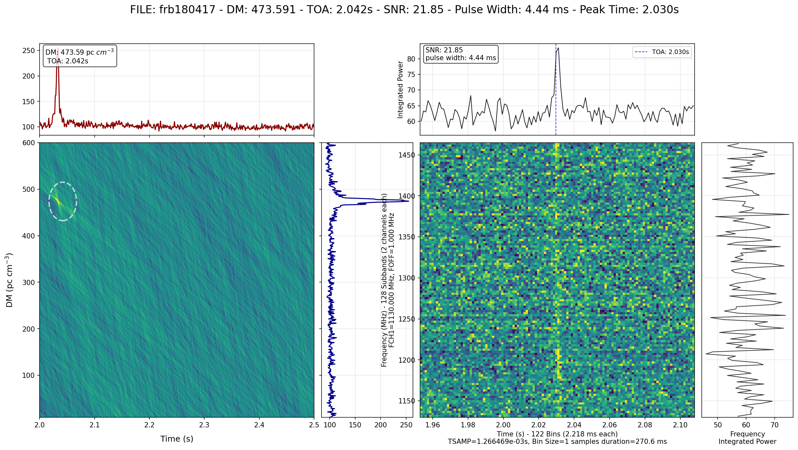

# 快速开始：在 FRB180417 上运行 astroflow

## 1) 获取FRB180417 filterbank 文件

**方式 A: Zenodo（推荐）**
```bash
wget -O FRB180417.fil "https://zenodo.org/record/3905426/files/FRB180417.fil"
```

**方式 B: GitHub raw（备用镜像）**  
```bash
curl -L -o FRB180417.fil   "https://raw.githubusercontent.com/lintian233/astroflow/main/tests/FRB180417.fil"
```

快速检查：
```bash
ls -lh FRB180417.fil # 1.7M
```

```bash
-rw-r--r-- 1 root root 1.7M Aug 26 20:12 FRB180417.fil
```

---

## 2) 创建运行配置文件

保存为 `frb180417.yaml`：

```yaml
# frb180417.yaml

input: FRB180417.fil      # 输入文件路径（区分大小写）
output: frb180417         # 输出目录路径（绘图和日志保存位置）

mode: single              # 搜索模式，可选 [single, muti, dataset, monitor]/ 单文件，目录，数据集，目录监测

timedownfactor: 1         # 时间轴降采样因子
confidence: 0.4           # 检测模型置信度阈值

dedgpu: 0                 # 解色散所用 GPU
detgpu: 0                 # 检测所用 GPU
cputhread: 8              # CPU 线程数（I/O 与预处理）

plotworker: 2             # 绘图进程数

modelname: yolov11n       # 检测模型名称（当前支持 yolov11n）

# maskfile: none.txt      # RFI 掩码文件（无则禁用）

tsample:
  - name: t1
    t: 0.5                 # 每片检测的时间长度（秒）
    # (脉冲宽度 ~ 1-10 ms 推荐 0.5s)
    # (脉冲宽度 ~ 0.1-0.5 ms 推荐 0.05s)

# DM 范围标签（只要这个DM范围内的候选体）
dm_limt:
  - name: limt1
    dm_low: 0
    dm_high: 800

# 实际 DM 搜索范围，FRB181407 的 DM ~ 474.8
dmrange:
  - name: dm_10_600
    dm_low: 10
    dm_high: 600
    dm_step: 1   # 建议搜索的DM实验数>512

# 频率范围 (MHz)
freqrange:
  - name: fullband
    freq_start: 1130
    freq_end: 1465
#   - name: lowband
#     freq_start: 1130
#     freq_end: 1250

# DMT (DM–time) 图配置
dmtconfig:
  minpercentile: 0
  maxpercentile: 99.99

# 动态频谱图配置
specconfig:
  minpercentile: 0.1
  maxpercentile: 99
  tband: 120                # 时间带宽
  mode: subband             # 模式，可选 [subband, standard, detrend]
```

> 说明
> - 多 GPU 可以把 `dedgpu` 与 `detgpu` 分配到不同设备，或通过 `CUDA_VISIBLE_DEVICES` 控制。

---

## 3) 运行

```bash
astroflow frb180417.yaml
```

你会看到类似如下日志输出：
```
Detected mode: single
Starting single file search for: FRB180417.fil
Using device: cuda:0 NAME: NVIDIA GeForce GTX 1660 SUPER
...
DM Range: 10-600, Freq Range: 1130-1465, TSample: 0.5
...
Typed data shape: [591, 5120]
Typed slicing preprocessing completed: 13 slices generated
Processed 12 samples in one batch.
Plotting candidate: DM=473.591, TOA=2.042, Freq=1130-1465 MHz, ...
Saving 21.85_4.44_473.591_2.042_frb180417_T_2.0s_2.5s_DM_10_600_F_1130_1465.png
```

---

## 4) 查看结果

输出图像会保存到 `output` 前缀目录下，例如：
```bash
ls frb180417/detect/*.png 

display frb180417/detect/*.png
```

你将看到类似的 PNG 图片：

<div align="center">
  
</div>
